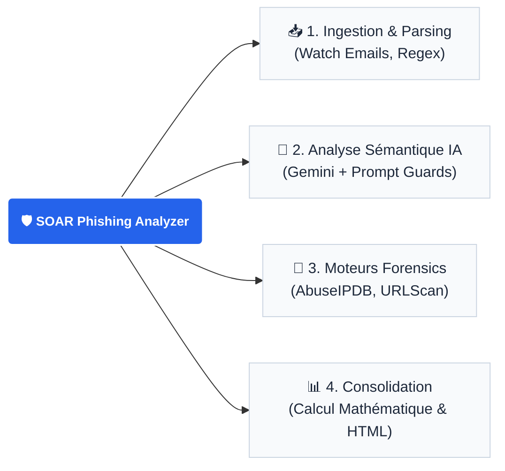

  <h1>SOAR Phishing Analyzer (Make.com + IA)</h1>
  
<b>Pipeline SecOps 100% automatisé pour l'analyse Forensics et Sémantique d'e-mails suspects.</b>

  

    
    
    
    
  

---

## Contexte & Objectif

Les équipes SOC (Security Operations Center) souffrent d'**"Alert Fatigue"** face à la masse d'e-mails suspects signalés par les collaborateurs. La qualification manuelle de ces alertes est répétitive et chronophage.

**La Solution :** J'ai architecturé ce SOAR (Security Orchestration, Automation, and Response) pour automatiser l'analyse de bout en bout. Il combine des moteurs Forensics traditionnels (réputation IP, sandboxing) avec une **Intelligence Artificielle (LLM)** pour comprendre le contexte sémantique de l'attaque.

---

## Architecture de Détection

L'architecture repose sur un design pattern *Scatter-Gather* : parallélisation des analyses et convergence vers un score unique.

<mark>Fonctionnalités Techniques Clés</mark> 

**<ins>1. Moteur Sémantique IA (Google Gemini)</ins>**  
**Détection d'Ingénierie Sociale :** Analyse du corps de l'e-mail pour détecter les sentiments d'urgence, la coercition ou l'usurpation d'identité. 
**Sécurité "Prompt Guard" :** Implémentation de garde-fous stricts dans le prompt pour empêcher les attaques par Prompt Injection (où un attaquant cacherait des instructions invisibles dans l'e-mail pour tromper l'IA). 
**Formatage JSON :** Contrainte de l'IA pour générer une réponse 100% JSON avec un verdict (SAFE, SUSPICIOUS, MALICIOUS), un score sur 50 et une justification. 

**<ins>2. Moteurs Forensics & Routage Dynamique</ins>**  
**Extraction d'IOCs :** Utilisation d'Expressions Régulières (Regex) avancées pour isoler les adresses IP, les domaines et les URLs cachées. 
**Aiguillage MIME :** Séparation dynamique des flux selon le type de pièce jointe (analyse visuelle pour les QR Codes, analyse binaire pour les PDF/ZIP). 
**Threat Intelligence :** Interrogation synchronisée des API AbuseIPDB et Urlscan.io. 

**<ins>3. Consolidation & Triage Automatisé</ins>**  
**Calculateur de Menace :** Utilisation de fonctions mathématiques (parseNumber, ifempty) pour agréger les scores isolés de chaque branche en un Score de Menace Global sur 100.
**Génération de Rapport HTML :** Création d'un template HTML dynamique injectant les variables pour restituer un tableau de bord lisible directement dans la boîte mail des analystes SOC.

📸 Aperçu du Projet
<table width="100%">
<tr>
<td width="50%" align="center">
<b>Arbre d'Orchestration (Make)</b>

<i>Vue globale du pipeline SecOps.</i>
</td>
<td width="50%" align="center">
<b>Rapport d'Investigation Généré</b> 

<i>Le résultat final exploitable par le SOC.</i>
</td>
</tr>
</table>

<i>Projet conçu dans le cadre de mon portfolio technique d'Analyste Cybersécurité.</i>

 Raccourcis vers mes Projets

<table>
<tr>
<td width="50%" valign="top">
<h3><a href="projet_1_cadrage.md">📅 P1 | Cadrage et Planification</a></h3>

Définition du cadre d'apprentissage, gestion du temps (SLA/Milestones) et mise en place de la méthodologie de travail collaboratif.

<code>Gestion de projet</code> <code>Time Management</code>
</td>
<td width="50%" valign="top">
<h3><a href="projet_2_ecosysteme.md">🗺️ P2 | Écosystème SOC</a></h3>

Cartographie de l'architecture de détection. Apprentissage des frameworks industriels et création de supports de sensibilisation interne.

<code>Cyber Kill-Chain</code> <code>NIST</code> <code>Sensibilisation</code>
</td>
</tr>
<tr>
<td width="50%" valign="top">
<h3><a href="projet_3_analyse_logs.md">📊 P3 | Analyse Logs & Triage</a></h3>

Prise en main de l'environnement MSSP. Fouille de logs bruts, extraction d'IoC, qualification d'alertes TheHive et gestion de faux positifs.

<code>Elastic (ELK)</code> <code>TheHive</code> <code>Triage L1</code>
</td>
<td width="50%" valign="top">
<h3><a href="projet_4_python.md">🐍 P4 | Scripts Python IR</a></h3>

Développement d'outils de détection de Web Shells. Parcours de répertoires, IoC Matching, et remédiation automatisée (Defanging).

<code>Python 3</code> <code>Automation</code> <code>Forensic</code>
</td>
</tr>
<tr>
<td width="50%" valign="top">
<h3><a href="projet_5_incidents.md">🧱 P5 | Endiguement & Réponse</a></h3>

Passage à la réaction active. Analyse de Kerberoasting, et automatisation du blocage d'IP malveillantes via scripts Python sur API Firewall.

<code>Incident Response</code> <code>Python</code> <code>API REST</code>
</td>
<td width="50%" valign="top">
<h3><a href="projet_6_forensic.md">🌐 P6 | Forensic Réseau</a></h3>

Investigation approfondie en milieu industriel. Analyse de traces réseaux (NTA), étude de fichiers PCAP et cadrage d'incident avancé.

<code>Wireshark</code> <code>PCAP</code> <code>Triage L2</code>
</td>
</tr>
<tr>
<td width="50%" valign="top">
<h3><a href="projet_7_gestion.md">🔗 P7 | Gestion d'Incident & Corrélation</a></h3>

Analyse de multiples alertes hétérogènes. Triage, élimination des faux positifs et reconstitution complète de la Cyber Kill-Chain.

<code>Wazuh</code> <code>MITRE ATT&CK</code> <code>TheHive</code>
</td>
<td width="50%" valign="top">
<h3><a href="projet_8_optimisation.md">⚙️ P8 | Optimisation & Détection</a></h3>

Tuning du SIEM pour limiter la fatigue d'alerte (Alert Fatigue). Création de règles Sigma et rédaction de Playbooks d'investigation.

<code>Detection Engineering</code> <code>Sigma</code> <code>Elastic</code>
</td>
</tr>
<tr>
<td width="50%" valign="top">
<h3><a href="projet_9_gestion_crise.md">🚨 P9 | Gestion de Crise CSIRT</a></h3>

Résolution d'un incident majeur (APT). Analyse de Spear Phishing, HTML Smuggling, et neutralisation d'exfiltration par DNS Tunneling.

<code>Forensic</code> <code>Snort</code> <code>AD</code> <code>Communication</code>
</td>
<td width="50%" valign="top">
<h3><a href="projet_10_soar.md">🤖 P10 | Ingénierie SOAR & SIEM</a></h3>

Conception d'une architecture de sécurité automatisée. Développement d'Analyzers Python (Cortex), workflows n8n et Dashboards Splunk.

<code>Splunk</code> <code>n8n</code> <code>Python</code> <code>TheHive</code>
</td>
</tr>
</table>

<i>Ce portfolio est mis à jour régulièrement au fil de mes investigations et projets personnels.</i>

</tr>
</table>
